# Tarea6SXE

### En esta tarea pondremos en marcha prestashop utilizando docker compose para su configuracion.

##### Lo primero que deberemos hacer sera crear el archivo de docker compose y configurarlo, para ello iremos a la ruta donde queramos rearlo y usaremos el siguiente comando
```
nano docker-compose.yml     #Copiar oara crear el archivo de docker compose
```
##### Una vez hecho esto se nos abrira un editor de texto donde pondremos la siguiente configuracion

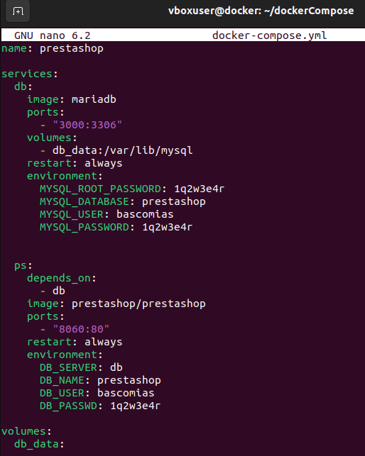

##### Para ejecutarlo iremos la ruta del archivo y pondremos e siguiente comando
```
sudo docker compose up -d      #Copiar para ejecutar el docker-compose
```
###### Como podremos ver se ejecua correctamente

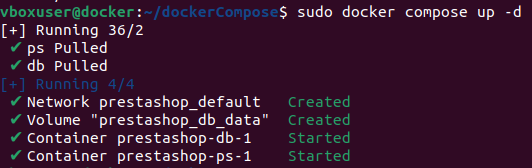

#### A continuacion ya podremos acceder desde nuestro navegador a la configuracion de prestashop poniendo en la barra de busqueda nuestra ip con el puerto asignado
```
10.0.2.15:8060      #Cambiar ip y puerto en caso de ser diferentes
ip a      #Copiar para ver tu ip
```

##### Una vez dentro tocara configurarlo todo

###### Configuracion del idioma

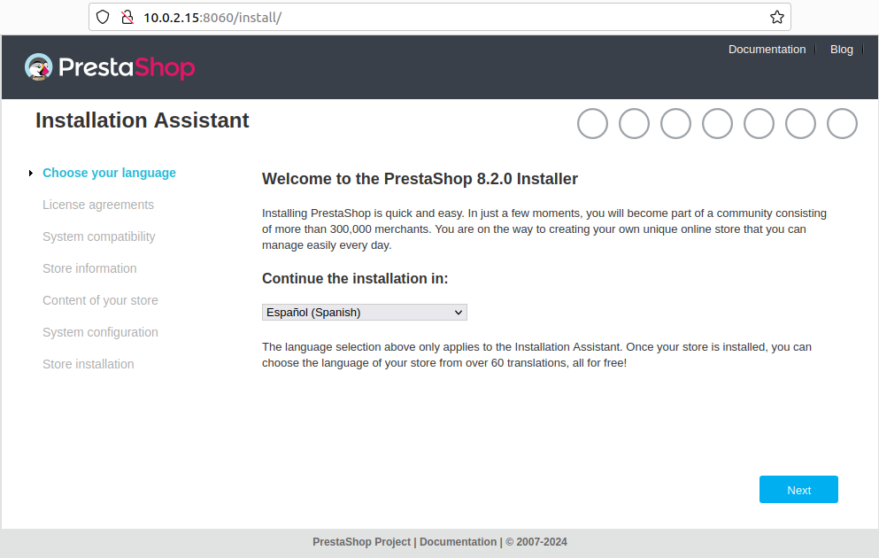

###### Terminos y condiciones de licencia

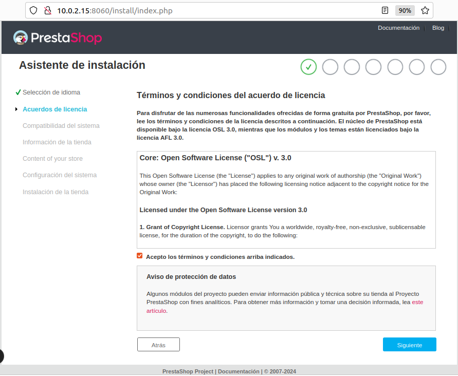

###### Configuramos la informacion de nuestra tienda

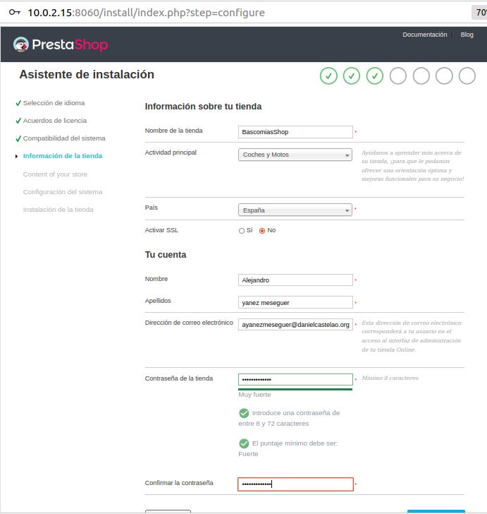

###### Configuramos el contenido de la tienda

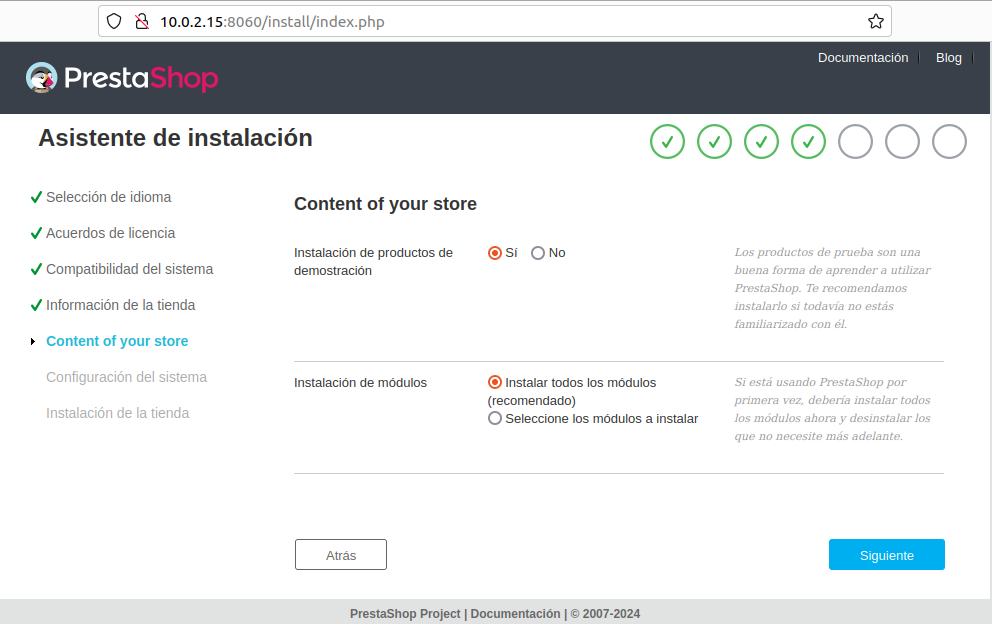

###### Configuramos el sistema

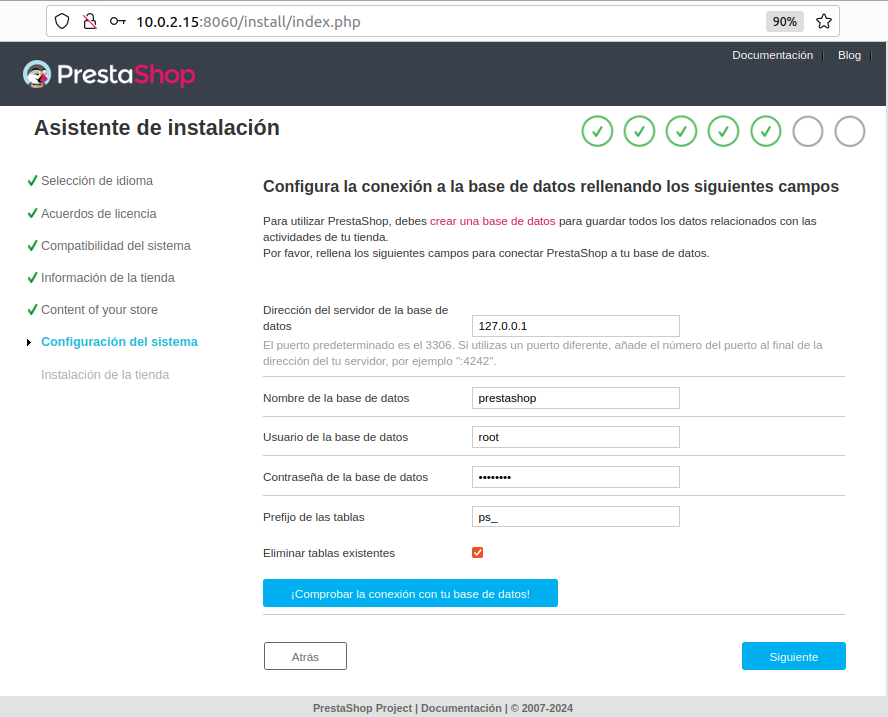

##### Por ultimo comenzara a descargarse

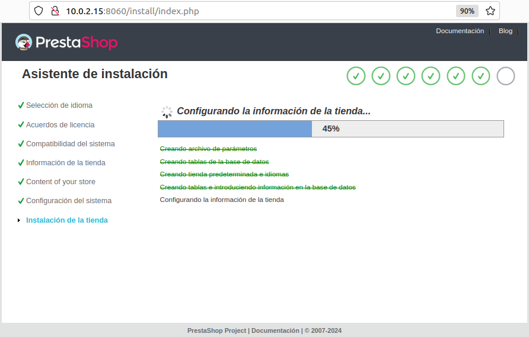

#### Una vez instalado nos pedira hacer una serie de pasos por razones de seguridad

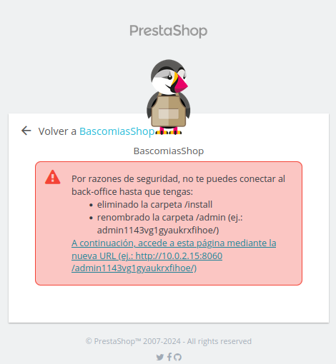

##### Para cumplir con estos pasos primero deberemos entrar en el contenedor donde esta las carpetas de la imagen con el siguiente comando
```
sudo docker compose exec ps bash      #Copiar para entrar en el contenedor
```
##### Una vez dentro borraremos la carpeta install con el siguiente comando
```
rm -r install/     #Copiar para borrar la carpeta install
```

##### Por ultimo renombraremos la carpeta admin al nombre que pide en el aviso
```
mv admin/ admin1143vg1gyaukrxfihoe/       #Copiar para renombrar la carpeta admin
```

##### Una vez hecho eso entraremos denuevo desde el navegador y iniciamos sesion

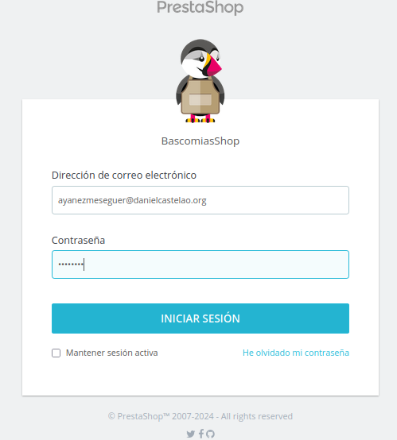

##### Despues de iniciar sesion ya estamos dentro

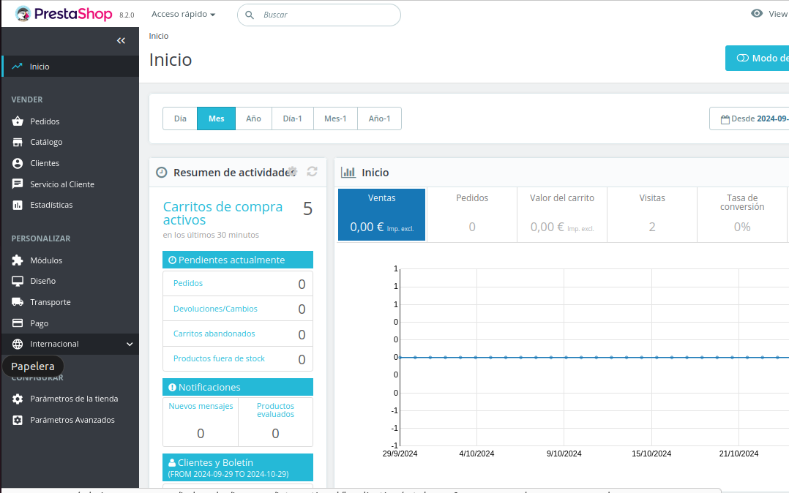


